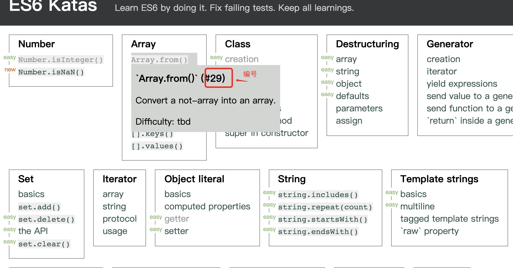

## 使用说明

### Gitlab 仓库: 
 - [https://code.choerodon.com.cn/frontend-train-201907-a/journal](https://code.choerodon.com.cn/frontend-train-201907-a/journal)


### 在线访问: 
 - [https://yunqiangwu.github.io/frontend-train-201907-a-journal/](https://yunqiangwu.github.io/frontend-train-201907-a-journal/)


### 本地运行

`npx serve`

---

## 每日总结

1. 在`docs/` 文件夹下创建自己工号对应的文件夹。
2. 创建成功以后，在文件夹下创建`docs/工号-姓名/_sidebar.md` 文件。文件内容如下：
    ```md
    * 日志
      * [7-11](docs/工号-姓名/07-11)
      * [7-12](docs/工号-姓名/07-12)
      * [7-13](docs/工号-姓名/07-13)
        
    * ES6练习题
      * [ ] [29](tests/工号-姓名/29.js)

    ```

    创建`docs/工号-姓名/README.md` 文件。文件内容如下：
    ```md
    ## 个人简介

    - 姓名: 吴云强
    - blog: https://wubaiqing.github.io/zaobao/ (这里按要求修改成自己的 hexo 发布的网站)

    ---

    [filename](./_sidebar.md ':include')

    ```
3. 然后在自己的文件夹下按照日期创建文件。如：`07-10.md`。写日志
4. 修改`docs/工号-姓名/_sidebar.md` 文件, 添加自己的日志文件索引。
5. 修改根目录下的 `_sidebar.md` 文件, 添加自己的日志文件夹索引。
   ```
   * 每日总结
     * [13485-吴云强](docs/13485/)
     * [工号-姓名](docs/工号-姓名/)
   ```

## 作业提交

1. 在 tests 文件夹下新建自己的文件夹 `工号-姓名` 。
2. 进入 [答题链接](https://yunqiangwu.github.io/es6katas.org/) ，完成相应的题目
3. 答完题目之后把答案保存到自己的文件夹(`tests/工号-姓名/`)中，文件名为 `题目编号.js`
   
4. 修改文件 `docs/工号-姓名/_sidebar.md` 添加一个文件索引， 前面有一个勾选框，
    ```md
    * ES6练习题
      * [ ] [29](tests/工号-姓名/29.js)

    ```
    
    当完成作业是可以在里面打钩。
    ```md
    * ES6练习题
      * [x] [29](tests/工号-姓名/29.js)

    ```

### 推荐练习顺序

1. Number、Array、Block scope、Destructuring、Object literal、Set、Arrow functions、Rest operator、Spread operator、Default parameters
2. String、Template strings
3. Class、Modules、Object、Iterator、
4. Promise、Generator
5.  Map、Symbol、Unicode、Reflect

### 测试验证作业 (Todo 还需要安装 mocha babel ...)

`npm run test`